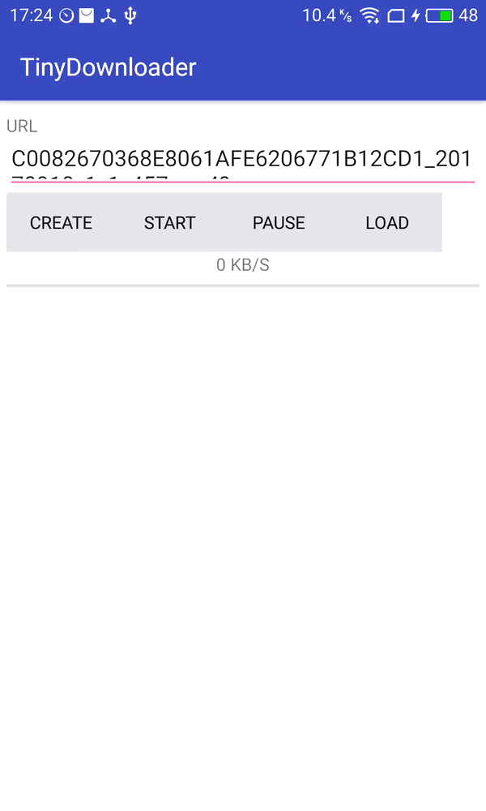
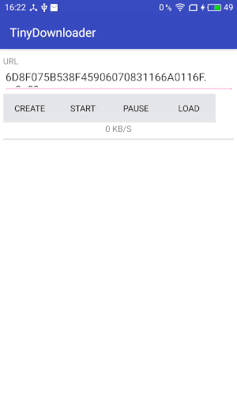

## TinyDownloader
[](https://raw.githubusercontent.com/TheoTian/TinyDownloader/dev/LICENSE)
[]()

This is a tiny downloader on Android, it just support Http & Https & HLS download now. Will support more in the future.

There is two ways to download.

1.	Normal.

2. Multi-Thread.

3. HLS 

##Quick Import

You could also choose quick way to import my exdownloader library into your project.

### Gradle
```
compile 'com.theo:exdownloader:1.1.0'
```

### Maven
```
<dependency>
  <groupId>com.theo</groupId>
  <artifactId>exdownloader</artifactId>
  <version>1.1.0</version>
  <type>pom</type>
</dependency>
```

## Getting started
See the demo code.


### CreateDownloader

```
mDownloader = DownloaderFactory.create(DownloaderFactory.Type.MULTI_SEGMENT, task);
if (mDownloader != null) {
    mDownloader.setListener(mDownloadListener);
    mDownloader.create();
}
```

### StartDownloader
```
mDownloader.start();
```

### PauseDownloader
```
mDownloader.pause();
```

### LoadDownloader

load the data(from onSaveInstance()) to create downloader.

resume download from the saved data.

```
 mDownloader = DownloaderFactory.load(FileUtil.readFile(new File(mTempPath)));
 if (mDownloader != null) {
     mDownloader.setListener(mDownloadListener);
 }
```


## Support
Any problem?

Welcome to contact me for help.


## License
Tinker is under the BSD license. See the [LICENSE](https://raw.githubusercontent.com/TheoTian/TinyDownloader/dev/LICENSE) file for details.

## Preview
### Normal & MultiThread


### HLS


